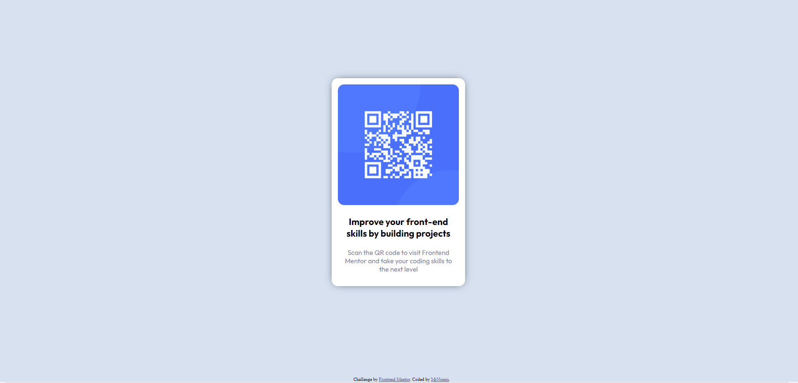

# Frontend Mentor - QR code component solution

This is a solution to the [QR code component challenge on Frontend Mentor](https://www.frontendmentor.io/challenges/qr-code-component-iux_sIO_H). Frontend Mentor challenges help you improve your coding skills by building realistic projects. 

## Table of contents
- [Screenshot](#screenshot)
- [My process](#my-process)
  - [Built with](#built-with)
  - [What I learned](#what-i-learned)
- [Author](#author)

### Screenshot

### Built with

- Semantic HTML5 markup
- CSS custom properties

### What I learned

So this is one of my first projects and I would say it was ok. I am still not sure how to center a div in the middle 
(horizontally and vertically). And i do not know if my code is good structured or not. I guess not so if anyone can give me some
advice how to do better it would be very appreciated.

## Author

- Frontend Mentor - [@MrNomis](https://www.frontendmentor.io/profile/MrNomis)

